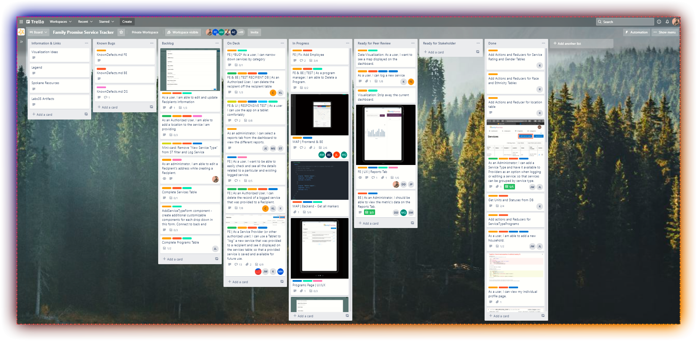

# Trello



.png>)

## Lambda School Labs and Trello

In this section, you will learn about Trello and how your teams will utilize it. Trello is a collaboration tool that organizes your projects into boards. One glance, Trello tells you tasks actively worked on, who's working on what, and where something is in a process.

Imagine a whiteboard filled with lists of sticky notes, with each section as a task for you and your team. Now imagine that each of those sticky notes has photos, attachments from other data sources like BitBucket or Salesforce, documents, and a place to comment and collaborate with your teammates.

.png>)

### Objective

Teams will be required to use Trello in labs. Trello brings clarity to each team member. Your team will use Trello during all phases of your development, and the board will follow the same theme. This section will review how your team will set up your board and an overview of each section.

#### Trello Board Overview

List - Trello is made of lists that the teams will work off of. A list is a collection of vertically arranged cards. They may represent a collection of ideas, things to remember, or different stages of a workflow. For labs, your team will use lists to manage your progress.

.png>)

Cards - The basic unit of the Trello board. Cards represent user stories, features, notes, and tasks. Your team will be able to drag cards from list to list to indicate progression, status, or what-have-you. You can add people to cards, label them, vote, attach files, start conversations, and create a task checklist.

.png>)

.png>)

| Trello Template & Card Guides                                                                                                                                         |
| --------------------------------------------------------------------------------------------------------------------------------------------------------------------- |
| [Lambda School Labs Template](https://trello.com/b/ObKu30qj/labs-ptlabs-team-trello-board-template/derekpeters6/recommend) - You can create a board from the template |
| [Editing a Card](https://help.trello.com/article/784-editing-cards)                                                                                                   |
| [Adding Labels to Cards](https://help.trello.com/article/797-adding-labels-to-cards)                                                                                  |
| [Adding a Checklist](https://help.trello.com/article/737-adding-checklists-to-cards)                                                                                  |
| [Adding Team Members to Cards](https://help.trello.com/article/807-adding-a-member-to-a-card)                                                                         |
| [Commenting on Cards](https://help.trello.com/article/765-commenting-on-cards)                                                                                        |
| [Adding Power-ups](https://help.trello.com/article/810-enabling-power-ups)                                                                                            |
| [Archiving and Deleting Cards](https://help.trello.com/article/795-archiving-and-deleting-cards)                                                                      |
